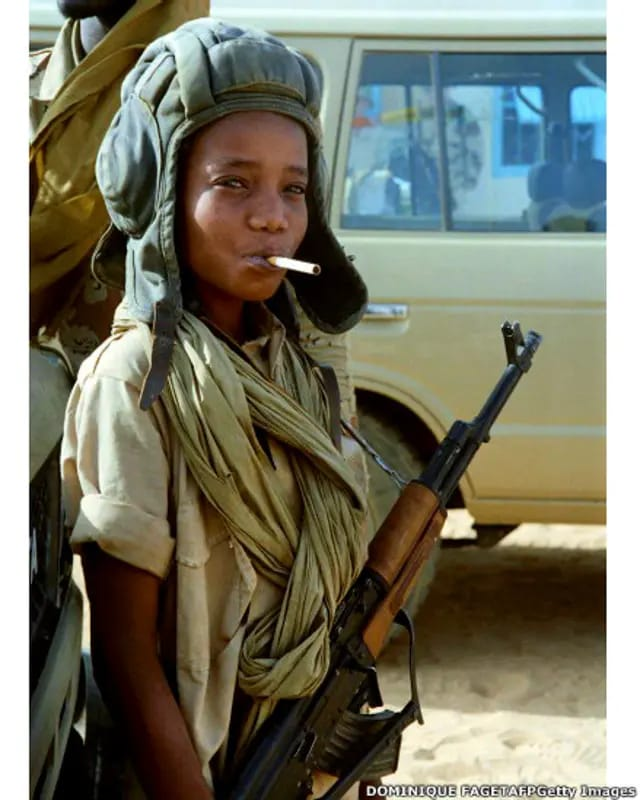
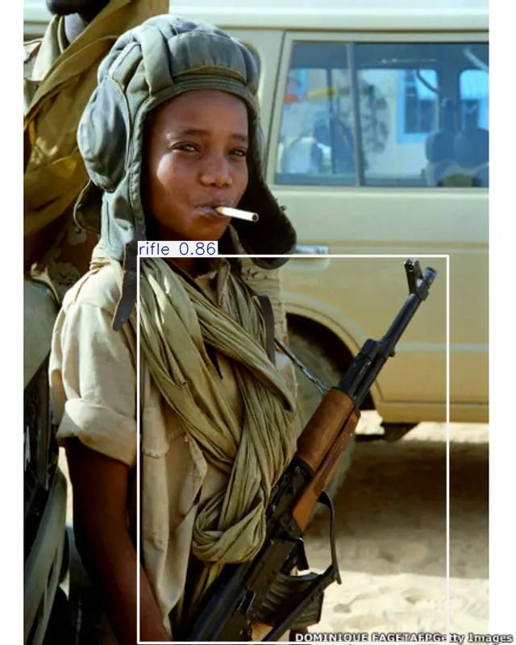

# 🔫 YOLOv11 Weapon Detection System

A complete **weapon detection system** built using **YOLOv11**, capable of detecting:
- 🗡️ Knife
- 🔫 Pistol
- 🪖 Rifle

The project is structured following **best practices** for machine learning projects and is ready for:
- Training & fine-tuning
- Evaluation
- Inference (images / videos / webcam)
- Deployment (API / Mobile / Edge)

---

## 📸 Detection Demos

Here is a comparison between raw input and the model's detection output:

| **Original Input** | **YOLOv11 Detection** |
|:------------------:|:---------------------:|
|  |  |
| *Original Scene* | *Detected* |
|  |  |
| *Original Scene* | *Detected* |
|  |  |

---


## 📁 Project Structure

```
yolov11-weapon-detection/
│
├── data/
│   ├── images/
│   │   ├── train/
│   │   ├── val/
│   │   └── test/
│   │
│   ├── labels/
│   │   ├── train/
│   │   ├── val/
│   │   └── test/
│   │
│   └── README.md
│
├── configs/
│   └── yolov11n.yaml
│
├── models/
│   └── yolov11n.pt
│
├── src/
│   ├── train.py
│   ├── detect.py
│   ├── evaluate.py
│   └── utils.py
│
├── notebooks/
│   └── data_exploration.ipynb
│
├── runs/
│
├── requirements.txt
├── .gitignore
├── README.md
└── LICENSE
```

---

## 📊 Dataset

⚠️ **The dataset is NOT included in this repository due to its large size (~2GB).**

The dataset is hosted externally on **Google Drive**.

### 📥 Dataset Download

Download the dataset from: 
https://drive.google.com/drive/folders/1eMlcL_0mKTWzchAIJpI47LIJSjqRIxtD?usp=sharing


After downloading, extract it so the folder structure matches:
```
data/
├── images/
│ ├── train/
│ ├── val/
│ └── test/
│
├── labels/
│ ├── train/
│ ├── val/
│ └── test/
```


📌 The `data/` folder is ignored in `.gitignore`.

---

## 🧠 Dataset Details

- Size: ~2GB
- Annotation format: YOLO
- Classes

| ID | Name   |
|----|--------|
| 0  | Knife  |
| 1  | Pistol |
| 2  | Rifle  |

Each label file follows:
2. **Labels:** `.txt` files containing: `<class_id> <x_center> <y_center> <width> <height>`

---

## ⚙️ Installation

```bash
pip install -r requirements.txt
```

---

## 🚀 Training

```bash
python src/train.py
```

---

## 🔍 Inference

### Images / Folder
```bash
python src/detect.py --source data/images/test
```

### Video
```bash
python src/detect.py --source video.mp4
```

### Webcam
```bash
python src/detect.py --source 0
```

---

## 📦 Export Model

```bash
yolo export model=models/yolov11n.pt format=onnx
```

---

## 📱 Deployment

- REST API (FastAPI / Flask)
- Mobile (ONNX / TFLite)
- Edge Devices

---

## 👨‍💻 Author

Weapon Detection System using YOLOv11
